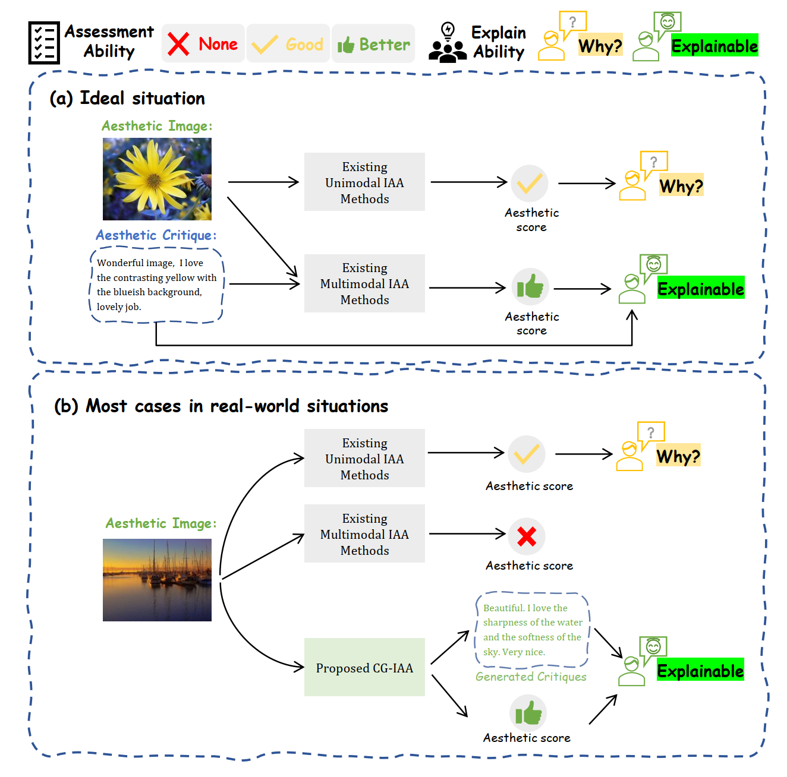
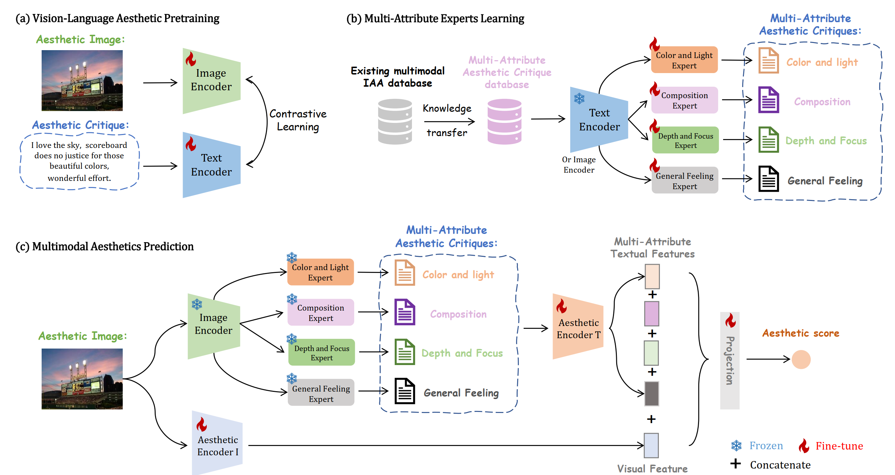
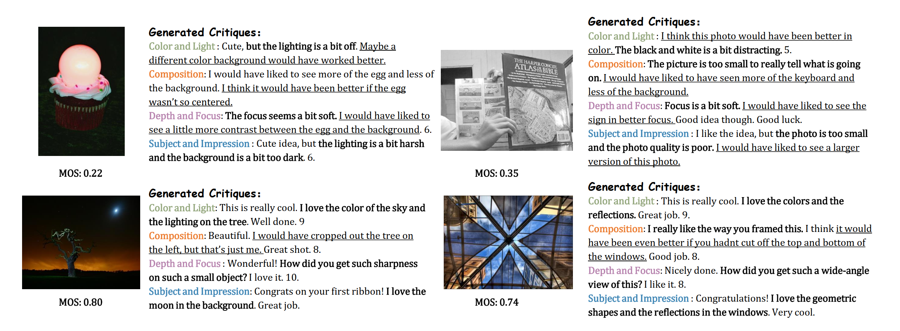

# Towards Explainable Image Aesthetics Assessment With Attribute-Oriented Critiques Generation

[](https://ieeexplore.ieee.org/document/10700814)
[](LICENSE)

## ⏰ Schedule

- **[2024-09-26]** Our CG-IAA paper was accepted by TCSVT! :balloon:

## 💡 Motivation

<p align="center">
    
</p>

Compared with the unimodal image aesthetics assessment (IAA), multimodal IAA has demonstrated superior performance. This indicates that the critiques could provide rich aesthetics-aware semantic information, which also enhance the explainability of IAA models. However, images are not always accompanied with critiques in real-world situation, rendering multimodal IAA inapplicable in most cases. Therefore, it would be interesting to investigate whether we can generate aesthetic critiques to facilitate image aesthetic representation learning and enhance model explainability.

## 🏗️ Pipeline

<p align="center">
    
</p>

We first conduct vision-language aesthetic pretraining for vanilla CLIP model to learn aesthetic-related knowledge. With the consideration that people usually evaluate images from different perspectives of  aesthetic attributes such as color, light, etc., a large multimodal IAA database with attribute annotation is constructed based on knowledge transfer. Then, the CLIP-based Multi-Attribute Experts (MAEs) are trained with the supervision of the constructed database. Finally, with the pretrained MAEs, we can not only improve the explainability of the aesthetic model, but also further obtain discriminative textual features. By fusing the textual aesthetic feature with the visual feature, more accurate multimodal aesthetic features are obtained to make the final aesthetic decision. 

## 🚀 Quick Start for Training & Evaluation

Coming soon.

## 🏆 Model Zoo

Coming soon.

## 📊 Visualization

<p align="center">
    
</p>

## 💙 Acknowledgement

CG-IAA is built upon the awesome [CLIP](https://github.com/openai/CLIP), [ClipCap](https://github.com/rmokady/CLIP_prefix_caption), [timm](https://github.com/huggingface/pytorch-image-models/). 

## 📚 Citation

If you find our work useful, please consider citing our paper:

```bibtex
@article{li2024cgiaa,
  author={Li, Leida and Sheng, Xiangfei and Chen, Pengfei and Wu, Jinjian and Dong, Weisheng},
  journal={IEEE Transactions on Circuits and Systems for Video Technology}, 
  title={Towards Explainable Image Aesthetics Assessment with Attribute-oriented Critiques Generation}, 
  year={2024},
  doi={10.1109/TCSVT.2024.3470870}}
```
